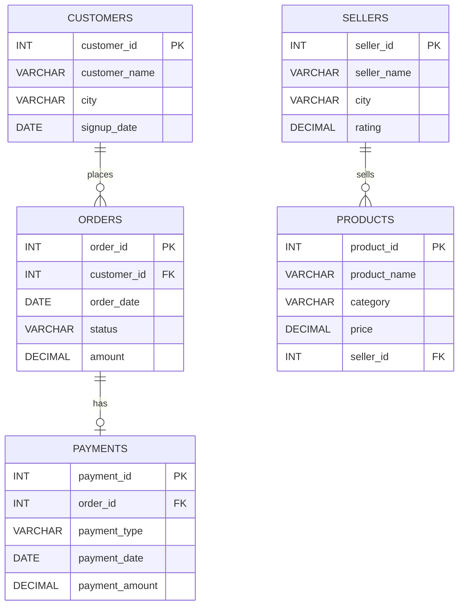
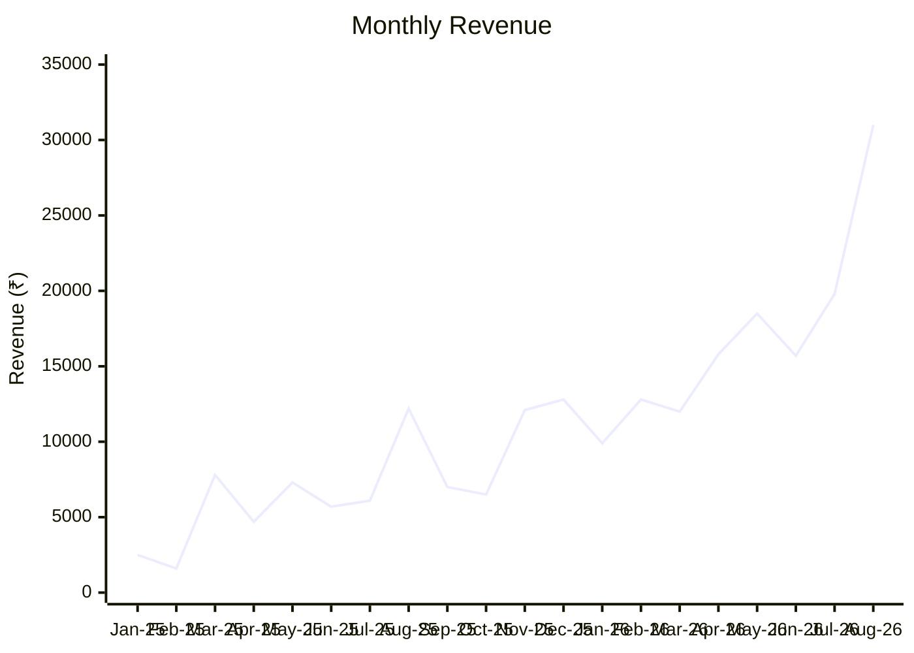

# 🛒 E-Commerce Sales & Customer Analytics — MySQL


## 📌 Project Overview

This project is a **MySQL-based E-Commerce Sales & Customer Analytics project** created as my first SQL portfolio project.

The objective of this project is to use SQL to explore an e-commerce dataset, answer practical business questions, and demonstrate important SQL concepts used in data analytics.

The database contains information about **customers, orders, sellers, products, and payments**.

The project includes **26 SQL business questions**, ranging from basic filtering and aggregation to subqueries, CTEs, window functions, views, and stored procedures.

---

## 🎯 Project Objectives

* Analyze customer and order data
* Identify high-value customers and orders
* Analyze revenue and order performance
* Compare order values across cities and statuses
* Practice advanced SQL concepts
* Create reusable SQL objects such as views and stored procedures
* Build a professional SQL portfolio project

---

## 🗄️ Database Schema

The database is named:

```sql
ecommerce_analytics
```

### Tables

| Table       | Description                                          |
| ----------- | ---------------------------------------------------- |
| `customers` | Customer information and signup details              |
| `orders`    | Order details, dates, statuses, and amounts          |
| `sellers`   | Seller information and ratings                       |
| `products`  | Product information, categories, prices, and sellers |
| `payments`  | Payment details associated with orders               |

### ER Diagram



> **Note:** The current project schema connects `customers → orders`, `orders → payments`, and `sellers → products`. The `orders` table does not currently contain a product/order-item relationship, so the main analytical questions focus on customer and order data.

---

## 📊 Dataset

The project uses a custom-built e-commerce dataset created for SQL learning and portfolio practice.

### Dataset size

* **30 customers**
* **60 orders**
* **10 sellers**
* **20 products**
* **60 payments**

---

## 🧠 SQL Concepts Practiced

### Basic SQL

* `SELECT`
* `WHERE`
* `ORDER BY`
* `LIMIT`
* Date filtering

### Aggregation

* `COUNT()`
* `SUM()`
* `AVG()`
* `MAX()`
* `GROUP BY`
* `HAVING`

### Joins

* `INNER JOIN`
* Joining customer and order information

### Conditional Logic

* `CASE`
* Customer spending classification
* Order value classification

### Subqueries

* Average customer spending
* Highest-value order
* Orders above average

### CTEs

* Customer spending analysis
* Monthly revenue analysis

### Window Functions

* `RANK()`
* `ROW_NUMBER()`
* `PARTITION BY`

### SQL Objects

* `VIEW`
* Stored Procedure

---

## 🔎 Business Questions

The project answers **26 business questions**.

### Beginner Analysis

1. List all customers who are from Kochi.
2. Find all orders placed in 2026.
3. Find the 10 most expensive orders.
4. Find all customers who signed up in 2025.
5. List all delivered orders.

### Intermediate Analysis

6. What is the total revenue generated so far?
7. Who are the top 5 customers based on total amount spent?
8. What is the average order value by city?
9. How many orders are there for each order status?
10. Find customers who have placed more than one order.
11. Which city generates the highest total revenue?
12. Find the total revenue generated for each order status.
13. What is the average order amount for each order status?
14. Find customers whose total spending is greater than ₹10,000.

### CASE Statement Analysis

15. Classify orders into High Value, Medium Value, and Low Value.
16. Count High Value, Medium Value, and Low Value orders.
17. Classify customers based on their total spending.

### Subquery Analysis

18. Find customers whose spending is greater than the average customer spending.
19. Find the customer who placed the highest-value single order.
20. Find all orders whose amount is greater than the average order amount.

### CTE Analysis

21. Find the top 5 customers by total spending using a CTE.
22. Find the month with the highest total revenue using a CTE.

### Window Function Analysis

23. Rank customers by total spending using `RANK()`.
24. Find each customer's first and most recent order using `ROW_NUMBER()`.

### SQL Objects

25. Create a `monthly_sales_summary` view.
26. Create a stored procedure `get_customer_history(customer_id)`.

---

## 📈 Monthly Revenue Analysis

The project includes a `monthly_sales_summary` view that calculates:

* Total orders
* Total revenue
* Average order value

```sql
CREATE VIEW monthly_sales_summary AS
SELECT
    DATE_FORMAT(order_date, '%Y-%m') AS month,
    COUNT(order_id) AS total_orders,
    SUM(amount) AS total_revenue,
    AVG(amount) AS average_order_value
FROM orders
GROUP BY DATE_FORMAT(order_date, '%Y-%m');
```

### Monthly Revenue Chart



> The monthly values in this chart are calculated from the `orders` data included in this project.

---

## ⭐ Featured SQL Queries

### 1. Top 5 Customers by Total Spending

```sql
WITH total_spending AS (
    SELECT
        customer_id,
        SUM(amount) AS total_amount
    FROM orders
    GROUP BY customer_id
)
SELECT *
FROM total_spending
ORDER BY total_amount DESC
LIMIT 5;
```

### 2. Customers Spending Above Average

```sql
SELECT
    customer_id,
    SUM(amount) AS total_amount
FROM orders
GROUP BY customer_id
HAVING SUM(amount) > (
    SELECT AVG(total_amount)
    FROM (
        SELECT
            customer_id,
            SUM(amount) AS total_amount
        FROM orders
        GROUP BY customer_id
    ) AS customer_spending
);
```

### 3. Customer Ranking Using a Window Function

```sql
SELECT
    customer_id,
    SUM(amount) AS total_amount,
    RANK() OVER (
        ORDER BY SUM(amount) DESC
    ) AS spending_rank
FROM orders
GROUP BY customer_id
ORDER BY spending_rank;
```

### 4. Monthly Revenue Using a CTE

```sql
WITH monthly_revenue AS (
    SELECT
        DATE_FORMAT(order_date, '%Y-%m') AS month,
        SUM(amount) AS total_revenue
    FROM orders
    GROUP BY DATE_FORMAT(order_date, '%Y-%m')
)
SELECT
    month,
    total_revenue
FROM monthly_revenue
ORDER BY total_revenue DESC
LIMIT 1;
```

### 5. Customer Order History Stored Procedure

```sql
DELIMITER //

CREATE PROCEDURE get_customer_history(IN p_customer_id INT)
BEGIN
    SELECT
        order_id,
        order_date,
        status,
        amount
    FROM orders
    WHERE customer_id = p_customer_id
    ORDER BY order_date;
END //

DELIMITER ;
```

---

## 🛠️ Tools Used

* **MySQL** — Database creation and SQL analysis
* **SQL** — Data querying and analysis
* **GitHub** — Project documentation and version control

---

## 📁 Project Structure

```text
ecommerce-sql-analytics/
│
├── README.md
│
├── ecommerce_analytics.sql
│
└── screenshots/
    ├── q07_top_customers.png
    ├── q18_above_average_customers.png
    ├── q22_monthly_revenue.png
    ├── q23_customer_ranking.png
    └── q25_monthly_sales_view.png
```

---

## 💡 Key Learning Outcomes

Through this project, I strengthened my understanding of:

* Writing SQL queries for real-world business questions
* Working with relational database tables
* Using aggregate functions for business analysis
* Combining tables using joins
* Filtering grouped data using `HAVING`
* Writing nested subqueries
* Creating and using CTEs
* Applying window functions for ranking and row-level analysis
* Creating reusable SQL views
* Creating stored procedures
* Structuring SQL code for a portfolio project

---

## 🚀 Future Improvements

Possible future improvements include:

* Connecting orders to products through an `order_items` table
* Adding product-level sales analysis
* Adding seller-level revenue analysis
* Creating an interactive dashboard using Power BI or Tableau
* Adding more advanced customer segmentation
* Adding additional business KPIs

---

## 📌 Project Status

**Completed — First SQL Portfolio Project**

This project represents my first step toward building a data analytics portfolio and applying SQL concepts to a practical business scenario.

---

## 👩‍💻 Author

**Divya Sree**

Aspiring Data Analyst | SQL | Python | Data Analytics

---

## 🙏 Acknowledgement

This project was developed as part of my learning journey in Data Analytics with guidance and training from **Luminar Technolab**.

---

## 📫 Connect With Me

* LinkedIn: *Add your LinkedIn profile link here*
* GitHub: *Add your GitHub profile link here*

---

### ⭐ If you find this project useful

Feel free to explore the SQL queries and analysis included in this repository.
