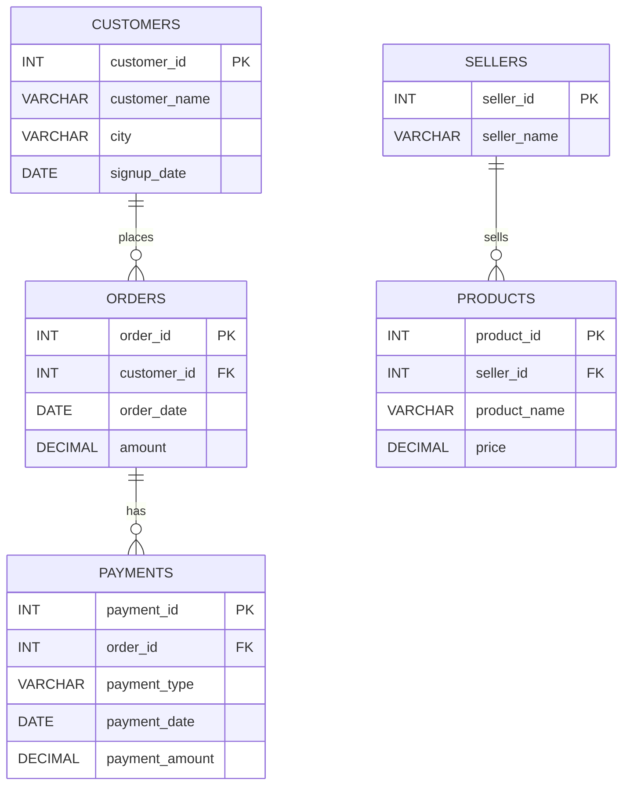

# 🛒 E-Commerce Sales & Customer Analytics — MySQL


## 📌 Project Overview

This project is a **MySQL-based E-Commerce Sales & Customer Analytics project** created as my first SQL portfolio project.

The objective of this project is to use SQL to explore an e-commerce dataset, answer practical business questions, and demonstrate important SQL concepts used in data analytics.

The database contains information about **customers, orders, sellers, products, and payments**.

The project includes **26 SQL business questions**, ranging from basic filtering and aggregation to subqueries, CTEs, window functions, views, and stored procedures.

---

## 🎯 Project Objectives

* Analyze customer and order data
* Identify high-value customers and orders
* Analyze revenue and order performance
* Compare order values across cities and statuses
* Practice advanced SQL concepts
* Create reusable SQL objects such as views and stored procedures
* Build a professional SQL portfolio project

---

## 🗄️ Database Schema

The database is named:

```sql
ecommerce_analytics
```

### Tables

| Table       | Description                                          |
| ----------- | ---------------------------------------------------- |
| `customers` | Customer information and signup details              |
| `orders`    | Order details, dates, statuses, and amounts          |
| `sellers`   | Seller information and ratings                       |
| `products`  | Product information, categories, prices, and sellers |
| `payments`  | Payment details associated with orders               |

### ER Diagram

> **Note:** The current project schema connects `customers → orders`, `orders → payments`, and `sellers → products`. The `orders` table does not currently contain a product/order-item relationship, so the main analytical questions focus on customer and order data.

---

## 📊 Dataset

The project uses a custom-built e-commerce dataset created for SQL learning and portfolio practice.

### Dataset Size

- **30 customers**
- **60 orders**
- **10 sellers**
- **20 products**
- **60 payments**

---

## 🧠 SQL Concepts Practiced

### Basic SQL

- `SELECT`
- `WHERE`
- `ORDER BY`
- `LIMIT`
- Date filtering

### Aggregation

- `COUNT()`
- `SUM()`
- `AVG()`
- `MAX()`
- `GROUP BY`
- `HAVING`

### Joins

- `INNER JOIN`
- Joining customer and order information

### Conditional Logic

- `CASE`
- Customer spending classification
- Order value classification

### Subqueries

- Average customer spending
- Highest-value order
- Orders above average

### CTEs

- Customer spending analysis
- Monthly revenue analysis

### Window Functions

- `RANK()`
- `ROW_NUMBER()`
- `PARTITION BY`

### SQL Objects

- `VIEW`
- Stored Procedure

---

## 📈 Monthly Revenue Analysis

The project includes a `monthly_sales_summary` view that calculates:

- Total orders
- Total revenue
- Average order value

```sql
CREATE VIEW monthly_sales_summary AS
SELECT
    DATE_FORMAT(order_date, '%Y-%m') AS month,
    COUNT(order_id) AS total_orders,
    SUM(amount) AS total_revenue,
    AVG(amount) AS average_order_value
FROM orders
GROUP BY DATE_FORMAT(order_date, '%Y-%m');
```

---
---
## 🛠️ Tools Used

* **MySQL** — Database creation and SQL analysis
* **SQL** — Data querying and analysis
* **GitHub** — Project documentation and version control

---

## 📁 Project Structure

ecommerce-sql-analytics/
│
├── README.md
└── ecommerce_analytics.sql

---

## 💡 Key Learning Outcomes

Through this project, I strengthened my understanding of:

* Writing SQL queries for real-world business questions
* Working with relational database tables
* Using aggregate functions for business analysis
* Combining tables using joins
* Filtering grouped data using `HAVING`
* Writing subqueries and CTEs
* Applying window functions for ranking and row-level analysis
* Creating reusable SQL views and stored procedures
* Structuring SQL code for a portfolio project

---

## 📌 Project Status

**Completed — First SQL Portfolio Project**

This project represents my first step toward building a data analytics portfolio and applying SQL concepts to a practical business scenario.

---

## 👩‍💻 Author

**Divya Sree**

Aspiring Data Analyst | SQL | Python | Data Analytics

---

## 🙏 Acknowledgement

This project was developed as part of my learning journey in Data Analytics with guidance and training from **Luminar Technolab**.

---

## 📫 Connect With Me

* LinkedIn: https://www.linkedin.com/in/divya-sree-6a268a2a3
* GitHub: https://github.com/Div-ya25


